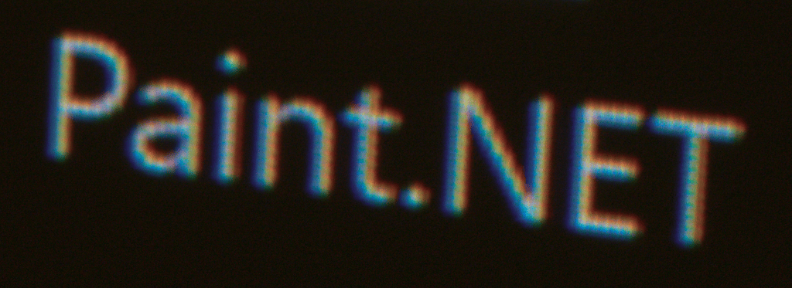
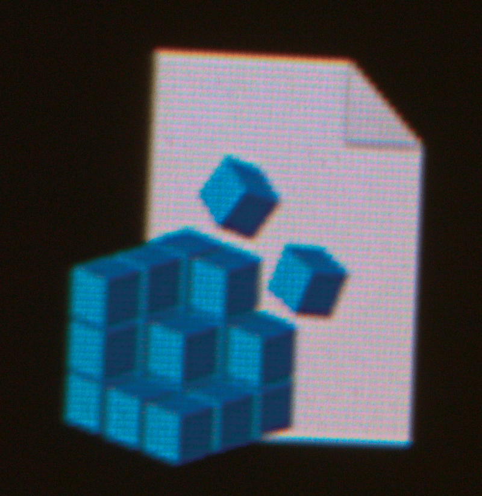
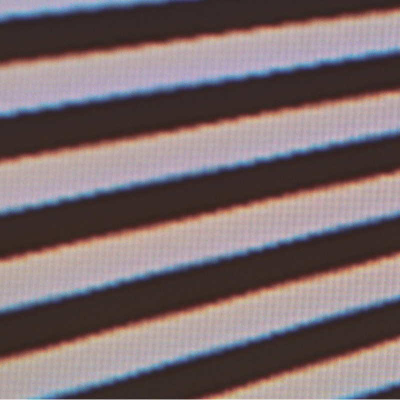

# RGB misaligment issue
Valerion VisionMaster projectors have a color shift issue that presents itself as a red & blue halos around light objects.

If you want to skip techinical detail and go to solution directly - clik [here](#results-and-demo-poc).

## background 
Historically there were many issues with similar characteristics:
- **misonvergence** in CRT TVs/monitors  
red, green, and blue electron beams don’t land on exactly the same spot on the phosphor
- **panel misaligment** in 3LCD/3DLP projectors  
red, green, and blue images from the three panels/chips don’t line up perfectly
- **chromatic aberration**  
caused by the projector’s optics focusing different wavelengths (colors) at different positions, so red/green/blue do not overlap perfectly

Each projector has a **light engine** which is colloquial term for hardware that generates a light and directs it towards a panel(s) that modulate light, so uniform light becomes an image.

If projector has a 3 panels, its **light engine** needs to produce 3 light beams (usually red, green and blue) shining precisely on those panels. Then generated images are aligned together using [dichroic mirrors](https://www.findlight.net/blog/dichroic-mirrors-explained-a-comprehensive-guide/) (passes one color, reflect others) or [dichroic prisms](https://en.wikipedia.org/wiki/Dichroic_prism) (splits/combines different colors to/from one direction) to form a converged path that goes out through the projector optics.

If projector has 1 panels, its **light engine** needs to produce 1 light beam shining precisely on this one panel. By switching lights fast, rapid sequence of red, green, blue beams shines to the same panel and goes through projector optics. Because of persistence of vision (effect in human visual system that persists image a while) full-color image is perceived.

For simplifaction I'm ingnoring color wheels and lamps, LEDs, and hybrid light sources.

## nature of the issue
Velerion projectors are 1 panel projector using micromirrors ([DLP/DMD](https://en.wikipedia.org/wiki/Digital_micromirror_device)) with 3 laser sources in its **light engine**.

So at the beginning we can cross-out CRT misaligment (duh!) and panel misalignment (theres only 1 panel).

**Light engine** of Valerion projector needs to generate 3 beams of light and align them precisely, so each light color must shine on its panel from the same direction.  
If issue would be caused by **light engine** (sligthly different directions) colors  on the screen would be shifted relative to each other.   

When light is modulated (reflected) by its DLP/DMD it becomes a image, it travels out through a sequence of lenses to form an image on the screen.  
If issue would be caused by lens this would be a form of chromatic aberration. As chromatic aberration is angle-dependent it would present itself as:
- **center of screen: no color shift**  
As it travels through optical path of lens system, there is no color shift.
- **corner of screen: red shifted to corner, blue towards center**  
As disance from center of image increase - the amount of color shift increase.  
As it's easy to blame every color issue on chromatic aberration I've prepared a [small in-browser demo](https://maciek-urbanski.github.io/valerion/rgb%20misalignment/chromatic_aberration.html), in which user can draw a image and it would generate a chromatic aberration for this image.

So the diffrentiating factor between chromatic aberration and **light engine** issue is uniformness:
- if color shift changes across the screen (with center having no color shift) it would be a chromatic aberration
- if color shift is uniform across the screen - it would be **light engine** issue

# analysis
To determin the issue I've designed a [test plate](https://maciek-urbanski.github.io/valerion/rgb%20misalignment/test_plate.png) that displays a pattern of cells, each cell having 2 parts:
- center with ArUco marker that encodes cell position in image (see OpenCV documentiation [here](https://docs.opencv.org/4.x/d5/dae/tutorial_aruco_detection.html))
- border with spots that allow for calculating shifts between R-G and B-G color planes using normalized cross correlation

ArUco markers allow capturing only part of image (with at least 4 markers) and calculate homography (how camera pixels map to pattern pixels).

Statistics for each marker are kept and processed to reduce noise in final shift estimation.
For each marker I calculate separate color shifts and present those across image in form of 2D shift vector for R-G and another for R-G per each cell.

All of this is quite complex for unitiated, but I'm adding all scripts to [scripts](scripts) subdirectory, and can expaln the details for the brave souls that want to replicate.  
Bear in mind that requirements include:
- good camera in manual mode (full F & ISO control with RAW/not collor balanced) is required
- ability to run python, install missing modules

# [results and demo PoC]
Analysis of my Valerion VisonMaster MAX shows that effect is uniform across the screen, so **its a light engine issue** not a ~~chromatic aberration~~ .

With this data I could devise a proof-of-concept of a software fix: a trivial algorithm that pre-shifts image planes before sending them to my projector. Shifts cancel each other and image has correct colors (and slightly better focus).

### preequisities
In order for this demo to work one needs to minimize amount of image processing the Valerion does by:
- Picture Mode: HDR Game
- Projector->Ultra Sharp Mode: ON
- Projector->DLP Turbo Mode: ON
- all AI-related stuff: OFF

### usage
All below on a PC with projector attached. I'm using Windows.
1. Open HTML with [proof-of-concept](https://maciek-urbanski.github.io/valerion/rgb%20misalignment/PoC.html).
2. make browser full-screen w/o border (F11 for Chrome/Brave/...)
3. load any image  
    - best to use screenshots from offending content
    - in [test_images](test_images) subdirectory there are some test images to get you started
4. there's a menu on the right that is initially active - click on any place on image you've just loated, so hotkeys starts working.  
Use arrows to shift R channel, press 2 to switch to B channel, press 1 to switch to R back. Alt makes movement smaller (1/100 of pixel instead of 1/10).

For me shifting red and blue color planes generated those before/after pairs (animated GIFs, you might need to press "play" button):  
- icon text:  
  
- icon image:  

- test pattern:  

### comments to results
This type of color issues are quite common in projectors with 3 light paths (either because of **light engine**, 3 panels, or both). Usually there are HW mechanisms to correct for this (for example [Epson](https://files.support.epson.com/docid/cpd5/cpd57551/source/adjustments/tasks/panel_aligning_four_corners.html) and even high-end Christie projectors used in cinemas suffer from this and have a "panel convergence" function).

So there are 2 solutions for it:
- hardware - I'd expect a mechanism that would adjust some part of light path to correct for this
- software - a color shift using 2x2 convolution can solve most of the problem
...saving grace is that software solution looks quite good.
#### can we do better ?
...of course!  
This and similar issues are fairly easy to correct, and because similar issues happen in photography there's a great body of knowledge how to this and simiar issues (chromatic aberration, vignetting), most using the same algorithm. When using something more (screen-adaptive, variable convolution) we could recover most of qulaity loss and even increase overall sharpness.  
...see [here](details.md) for more details. 

### AI use
All of the code above was developed with AI in a loop. Human designed & tested it, AI did the implementation.  
On a personal note, it's like a having a quite competent development team at my fingertips.

### next steps
If you have problem replicating - you can contact me at maciek0urbanski@gmail.com .